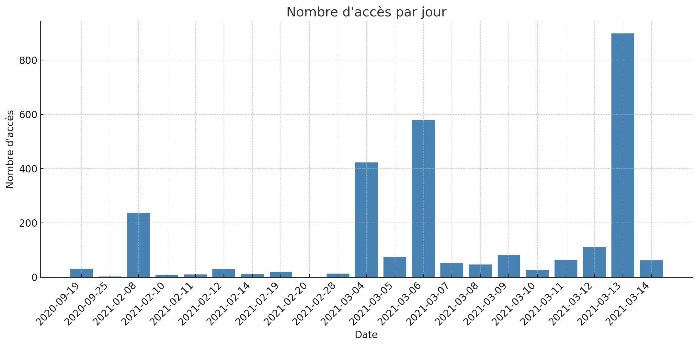
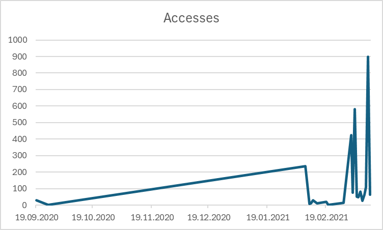

# Rapport : Laboratoire 3 ADS

## Auteurs

- Amir Mouti
- Ouweis Harun

## 1. Introduction

Ce rapport documente les différentes étapes et expérimentations réalisées dans le cadre du laboratoire sur la redirection des entrées/sorties sous Linux et l'analyse de logs web. Il inclut les commandes exécutées, les sorties obtenues ainsi que des explications détaillées pour chaque exercice.

---

## 2. Task 1 : Exercises on redirection

### 2.1. Compilation et exécution du programme `out.cpp`

Le programme C++ suivant génère une série de caractères sur les sorties standard et erreur.

```cpp
#include <iostream>
#include <cstdlib>
using namespace std;

int main() {
    for (int i = 0; i < 5; ++i) {
        cout << "O";  // Sortie standard
        cerr << "E";  // Sortie d'erreur
    }
    return EXIT_SUCCESS;
}
```

---

### 2.2. Expérimentations avec la redirection des sorties

#### 2.2.1. Redirection de stdout vers un fichier

##### Commande exécutée

```bash
./out > file
```

##### **Sortie obtenue :**

EEEEE dans le terminal et OOOOO dans le fichier `file`.

##### **Explication :**

Cette commande exécute `./out` et redirige la sortie standard vers le fichier `file`. Seuls les caractères envoyés avec `cout` seront écrits dans `file`, tandis que la sortie d’erreur s'affichera toujours à l'écran.

---

#### 2.2.2. Redirection de stderr vers un fichier

##### Commande exécutée

```bash
./out 2> file
```

##### Sortie obtenue

OOOOO dans le terminal et EEEEE dans le fichier `file`.

##### Explication

L’opérateur `2>` redirige **stderr** vers `file`, tandis que **stdout** reste affiché à l'écran.

---

#### **2.2.3. Redirection combinée de stdout et stderr vers un fichier**

##### Commande exécutée

```bash
./out > file 2>&1
```

##### Sortie obtenue

rien dans le terminal et OEOEOEOEOE dans le fichier `file`.

##### Explication

Cette commande redirige d'abord **stdout** vers `file` (`> file`), puis `2>&1` signifie que **stderr** est redirigé vers le même fichier que **stdout**.

---

#### 2.2.4. Ordre inversé de redirection des flux

##### Commande exécutée

```bash
./out 2>&1 > file
```

##### Sortie obtenue

EEEEE dans le terminal et OOOOO dans le fichier `file`.

##### Explication

La différence avec la commande précédente réside dans l’ordre d’exécution des redirections. Ici, **stderr** est redirigé vers **stdout** avant que **stdout** ne soit envoyé dans `file`, ce qui a pour conséquence d'afficher **stderr** à l'écran.

---

#### 2.2.5. Redirection simplifiée avec `&>`

##### Commande exécutée

```bash
./out &> file
```

##### Sortie obtenue

rien dans le terminal et OEOEOEOEOE dans le fichier `file`.

##### Explication

L’opérateur `&>` est une notation simplifiée pour `> file 2>&1`, permettant de rediriger simultanément **stdout** et **stderr** vers `file`.

---

### **2.3. Analyse de commandes et manipulation des fichiers**

#### **2.3.1. Analyse des commandes**

#### **Commande 1 : Recherche de texte dans un fichier**

```bash
cat /usr/share/doc/cron/README | grep -i edit
```

##### **Sortie obtenue :**

```bash
* documentation (don't take credit for my work), mark your changes (don't
have to go edit a couple of files... So, here's the checklist:
        Edit config.h
        Edit Makefile
```

##### **Explication :**

- `cat /usr/share/doc/cron/README` affiche le contenu du fichier **README** du paquet `cron`.
- `| grep -i edit` filtre le contenu pour n'afficher que les lignes contenant le mot **edit**, en ignorant la casse (`-i`).

---

#### **Commande 2 : Filtrage des erreurs affichées par `out`**

```bash
./out 2>&1 | grep -i eeeee
```

##### **Sortie obtenue :**

rien dans le terminal.

##### **Explication :**

- `./out 2>&1` redirige **stdout et stderr** vers le même flux de sortie.
- `| grep -i eeeee` recherche la présence de la chaîne **"eeeee"**, insensible à la casse.

Etant donné que la chaine sortie par `./out 2>&1` ne contient pas la chaine "eeeee", la commande ne retourne rien.

---

#### **Commande 3 : Suppression de la sortie, puis filtrage**

##### **Commande exécutée :**

```bash
./out 2>&1 >/dev/null | grep -i eeeee
```

##### **Sortie obtenue :** *(À compléter après exécution)*

##### **Explication :**

- `./out 2>&1` redirige **stdout et stderr** vers le même flux de sortie.
- `>/dev/null` supprime seulement **stdout** , et non stderr et renvoie la chaîne EEEEE.
- `| grep -i eeeee` tente ensuite de filtrer la sortie, et affiche donc en rouge EEEEE.

---

### **2.3.2. Manipulation des fichiers**

#### **Commande 4 : Liste récursive des fichiers et dossiers du home**

##### **Commande exécutée :**

```bash
ls -laR ~ > /tmp/homefileslist
```

ensuite on vérifie cela en faisant

```bash
head -n 20 /tmp/homefileslist
```

ou

```bash
cat /tmp/homefileslist
```

##### **Sortie obtenue :**

On peut voir la liste des fichiers et dossiers du home.

##### **Explication :**

- `ls -laR ~` :
  - `-l` : Affiche les permissions et métadonnées des fichiers.
  - `-a` : Inclut les fichiers cachés (`.` et `..`).
  - `-R` : Active l'affichage **récursif**.
  - `~` : Cible le **dossier personnel de l'utilisateur**.
- `> /tmp/homefileslist` enregistre la sortie dans le fichier `/tmp/homefileslist`.

---

#### **Commande 5 : Liste des fichiers spécifiques dans le home**

##### **Commande exécutée :**

```bash
find ~ -maxdepth 1 -type f \( -name "*.txt" -o -name "*.md" -o -name "*.pdf" \) > /tmp/homedocumentslist
```

et ensuite on vérifie cela en faisant

```bash
cat /tmp/homedocumentslist
```

##### **Sortie obtenue :**

```bash
/home/tobioo/notes.md
/home/tobioo/test1.txt
/home/tobioo/document.txt
/home/tobioo/rapport.pdf
/home/tobioo/test2.md
```

##### **Explication :**

- `find ~` : Recherche dans le répertoire **home** de l'utilisateur.
- `-maxdepth 1` : Limite la recherche au **répertoire home uniquement** (sans explorer les sous-dossiers).
- `-type f` : Filtre pour **ne garder que les fichiers** (exclut les répertoires).
- `\( -name "*.txt" -o -name "*.md" -o -name "*.pdf" \)` :
  - `-name "*.txt"` sélectionne les fichiers **.txt**.
  - `-o` (OR) permet de rechercher **plusieurs types de fichiers**.
  - `-name "*.md"` sélectionne les fichiers **.md**.
  - `-name "*.pdf"` sélectionne les fichiers **.pdf**.
- `> /tmp/homedocumentslist` : Redirige la sortie vers le fichier `/tmp/homedocumentslist`.

---

## **3. Task 2 : Analyse des logs**

---

### **3.1. Nombre total d’entrées dans le fichier**

##### **Commande utilisée :**

```bash
wc -l ads_website.log
```

##### **Réponse :**

Nous obtenons :

```bash
2781 ads_website.log
```

Nous avons donc 2781 entrées dans le fichier `ads_website.log`.

##### **Explication :**

- `wc -l` (**word count, option `-l`**) compte **le nombre de lignes** dans un fichier.
- Chaque ligne du fichier représente une **entrée de log**.
- Cette commande retourne donc **le nombre total d’entrées** dans `ads_website.log`.

---

### **3.2. Nombre d’accès réussis (200) et d’erreurs 404**

##### **Commande utilisée :**

```bash
cut -f10 ads_website.log | sort | uniq -c | grep -E '200|404'
```

##### **Réponse :**

Nous obtenons :

```bash
    1610 200
    21 404
```

Nous avons donc 1610 accès réussis (200) et 21 erreurs 404.

##### **Explications :**

- `cut -f10` extrait **le champ 10**, qui contient **le code HTTP**.
- `sort` trie les valeurs (nécessaire pour `uniq`).
- `uniq -c` compte **le nombre d’occurrences** de chaque code HTTP.
- `grep -E '200|404'` filtre pour ne conserver que **les codes 200 et 404**.

Cette commande retourne donc **le nombre de requêtes ayant abouti (200) et le nombre d’erreurs 404 (Not Found).**

---

### **3.3. Liste des URIs ayant généré une erreur 404**

##### **Commande utilisée :**

```bash
awk -F'\t' '$10 == 404 {print $9}' ads_website.log | sort | uniq
```

##### **Réponse :**

Nous obtenons :

```bash
"GET /heigvd-ads?cors HTTP/1.1"
"GET /heigvd-ads?lifecycle HTTP/1.1"
"GET /heigvd-ads?policy HTTP/1.1"
"GET /heigvd-ads?website HTTP/1.1"
```

Nous avons donc 4 URIs qui ont généré une erreur 404.

##### **Explication :**

- `awk -F'\t' '$10 == 404 {print $9}'` :
  - `-F'\t'` définit la tabulation comme séparateur.
  - `$10 == 404` sélectionne uniquement les lignes où **le code HTTP (colonne 10) est 404**.
  - `{print $9}` affiche **le champ 9**, qui correspond à l’**URI de la requête**.
- `sort | uniq` trie les URIs et affiche **une liste unique**.

Cette commande affiche **toutes les URIs qui ont produit une erreur 404**.

---

### **3.4. Nombre de jours différents présents dans le fichier**

##### **Commande utilisée :**

```bash
cut -f3 ads_website.log | cut -d':' -f1 | sort | uniq | wc -l
```

##### **Réponse :**

Nous obtenons :

```bash
21
```

Nous avons donc 21 jours différents dans le fichier.

##### **Explication :**

- `cut -f3` extrait **le champ 3**, contenant la **date et l'heure** du log.
- `cut -d':' -f1` garde seulement **la partie contenant la date** (`[19/Sep/2020]`).
- `sort | uniq` trie et élimine les doublons.
- `wc -l` compte **le nombre de jours distincts** dans le fichier.

Cette commande retourne **le nombre total de jours différents** dans le fichier.

---

### **3.5. Nombre d’accès le 4 mars 2021**

##### **Commande utilisée :**

```bash
grep '\[04/Mar/2021' ads_website.log | wc -l
```

##### **Réponse :**

Nous obtenons :

```bash
423
```

Nous avons donc 423 accès enregistrés le 4 mars 2021.

##### **Explication :**

- `grep '\[04/Mar/2021'` recherche **toutes les lignes contenant la date `[04/Mar/2021`**.
- `wc -l` compte **le nombre de lignes correspondantes**.

Cette commande donne **le nombre d’accès enregistrés le 4 mars 2021**.

---

### **3.6. Les trois jours avec le plus d’accès**

##### **Commande utilisée :**

```bash
cut -f3 ads_website.log | cut -d':' -f1 | sort | uniq -c | sort -nr | head -n 3
```

##### **Réponse :**

Nous obtenons :

```bash
    898 [13/Mar/2021
    580 [06/Mar/2021
    423 [04/Mar/2021
```

Nous avons donc les trois jours suivants avec le plus d'accès : 13 mars 2021, 6 mars 2021 et 4 mars 2021.

##### **Explication :**

- `cut -f3` extrait le champ contenant **la date et l’heure** de l’accès.
- `cut -d':' -f1` garde seulement **la partie contenant la date** (`[19/Sep/2020]`).
- `sort | uniq -c` :
  - `sort` trie les dates.
  - `uniq -c` **compte** le nombre d’occurrences de chaque date.
- `sort -nr` :
  - `-n` trie numériquement.
  - `-r` affiche **les plus grands nombres en premier**.
- `head -n 3` affiche **les trois jours avec le plus d’accès**.

Cette commande retourne **les trois jours où le site a reçu le plus de visites**.

---

### **3.7. User-agent ayant effectué le plus d’accès**

##### **Commande utilisée :**

```bash
cut -f17 ads_website.log | sort | uniq -c | sort -nr | head -n 1
```

##### **Réponse :**

Nous obtenons :

```bash
   423 "Mozilla/5.0 (Windows NT 6.3; WOW64; rv:27.0) Gecko/20100101 Firefox/27.0"
``` 

l'user-agent le plus fréquent est Mozilla/5.0 (Windows NT 6.3; WOW64; rv:27.0) Gecko/20100101 Firefox/27.0.

##### **Explication :**

- `cut -f17` extrait le **champ user-agent**.
- `sort | uniq -c` :
  - Trie les user-agents.
  - `uniq -c` compte **le nombre d’apparitions de chaque user-agent**.
- `sort -nr` :
  - `-n` trie numériquement.
  - `-r` affiche les plus grands nombres en premier.
- `head -n 1` affiche **le user-agent le plus fréquent**.

Cette commande donne **le navigateur ou logiciel ayant effectué le plus de requêtes**.

---

### **3.8. Nombre d’accès depuis Windows, Linux et Mac OS X**

##### **Commande utilisée pour Windows :**

```bash
grep -i "Windows" ads_website.log | wc -l
```

##### **Commande utilisée pour Linux :**

```bash
grep -i "Linux" ads_website.log | wc -l
```

##### **Commande utilisée pour Mac OS X :**

```bash
grep -i "Mac OS X" ads_website.log | wc -l
```

##### **Réponse :**

Nous obtenons :

```bash
    1751    # Windows
    180     # Linux
    693     # Mac OS X
```

Nous avons donc 1751 accès depuis Windows, 180 depuis Linux et 693 depuis Mac OS X.

##### **Explication :**

- `grep -i` recherche **insensiblement à la casse** (`Windows`, `Linux`, `Mac OS X`).
- `wc -l` compte **le nombre de lignes** où ces termes apparaissent.

Ces commandes donnent **le nombre d’accès depuis Windows, Linux et Mac OS X**.

---

### **3.9. Enregistrement des user-agents Windows avec `tee`**

##### **Commande utilisée :**

```bash
grep -i "Windows" ads_website.log | tee useragents.txt | wc -l
```

##### **Réponse :**

Nous obtenons :

```bash
1751
```

Nous avons donc 1751 accès depuis Windows comme trouvé précédemment.

##### **Explication :**

- `grep -i "Windows"` filtre les accès depuis Windows.
- `tee useragents.txt` :
  - **Écrit** le résultat dans `useragents.txt`.
  - **Continue** à afficher la sortie dans le terminal.
- `wc -l` compte **le nombre d’accès Windows**.

Cette commande permet **d’enregistrer les user-agents Windows tout en affichant le nombre d’accès**.

---

### **3.10. Pourquoi le fichier `access.log` est-il plus difficile à analyser ?**

##### **Explication :**

Le fichier `access.log` utilise **des espaces comme séparateurs**, alors que `ads_website.log` utilise **des tabulations**. Cela pose plusieurs problèmes :

1. **Séparateurs multiples** :  
   - Les champs de `access.log` sont séparés par **un nombre variable d’espaces**, ce qui complique l’utilisation de `cut` ou `awk -F ' '` (les colonnes peuvent se décaler).
2. **Les user-agents contiennent des espaces** :  
   - Dans `ads_website.log`, `cut -f17` fonctionne bien car les champs sont **strictement définis**.
   - Dans `access.log`, le champ user-agent peut contenir **des espaces**, ce qui complique son extraction.
3. **Solutions alternatives nécessaires** :  
   - Pour analyser `access.log`, il faut **utiliser des expressions régulières** (`grep`, `sed` ou `awk`) pour correctement extraire les champs.

---

## **4. Task 3 : Conversion des logs en CSV et visualisation**

### **4.1. Génération du fichier CSV**

Nous avons généré un fichier CSV `accesses.csv` contenant pour chaque jour le **nombre d'accès** enregistrés en utilisant la commande suivante :

```bash
echo "Date;Accesses" > accesses.csv
cut -f3 ads_website.log | cut -d':' -f1 | tr -d '[]' | awk '
{
    split($1, d, "/");
    month = (d[2] == "Jan") ? "01" :
            (d[2] == "Feb") ? "02" :
            (d[2] == "Mar") ? "03" :
            (d[2] == "Apr") ? "04" :
            (d[2] == "May") ? "05" :
            (d[2] == "Jun") ? "06" :
            (d[2] == "Jul") ? "07" :
            (d[2] == "Aug") ? "08" :
            (d[2] == "Sep") ? "09" :
            (d[2] == "Oct") ? "10" :
            (d[2] == "Nov") ? "11" : "12";
    print d[3] "-" month "-" d[1]
}' | sort | uniq -c | awk '{print $2";"$1}' >> accesses.csv
```

---

### **4.2. Explication de la commande**

1. **Création de l'en-tête du CSV :**
   - `echo "Date;Accesses" > accesses.csv` ajoute la ligne d'en-tête.

2. **Extraction des dates :**
   - `cut -f3 ads_website.log` récupère **la colonne contenant la date et l'heure**.
   - `cut -d':' -f1` garde uniquement **la partie contenant la date** (supprime l'heure).
   - `tr -d '[]'` enlève les **crochets `[` et `]`** entourant les dates.

3. **Conversion des noms de mois en format numérique :**
   - `awk` scanne chaque ligne, extrait le jour (`d[1]`), le mois (`d[2]`) et l'année (`d[3]`).
   - Les mois sont convertis en nombres (`Jan` → `01`, `Feb` → `02`, etc.).
   - La date est reformattée sous la forme **AAAA-MM-JJ**.

4. **Comptage des accès par jour :**
   - `sort | uniq -c` trie et compte **le nombre d'occurrences** de chaque date.

5. **Formatage final pour le CSV :**
   - `awk '{print $2";"$1}'` met la date en première colonne et le nombre d'accès en seconde colonne.

---

### **4.3. Résultat du fichier CSV**

Le fichier `accesses.csv` généré contient des entrées sous ce format :

```csv
Date;Accesses
2020-09-19;31
2020-09-25;2
2021-02-08;236
2021-02-10;9
2021-02-11;10
...
```

---

### **4.4. Visualisation des résultats**

Nous avons ensuite utilisé excel pour visualiser les données sous forme d'histogramme.

---

### **4.5. Résultats obtenus**

L'histogramme suivant représente le **nombre d'accès par jour** basé sur les logs et le second montre la chronologie des accès :




#### **Interprétation des résultats :**

- Nous observons des pics d'accès importants à certaines dates, notamment **le 13 mars 2021**, qui représente le jour avec le plus grand nombre d'accès.
- Certaines périodes enregistrent très peu d'activité, ce qui pourrait être dû à une baisse de fréquentation du site ou à une indisponibilité temporaire.
- La répartition des accès est **irrégulière**, ce qui pourrait indiquer des événements spécifiques influençant le trafic du site.

---
