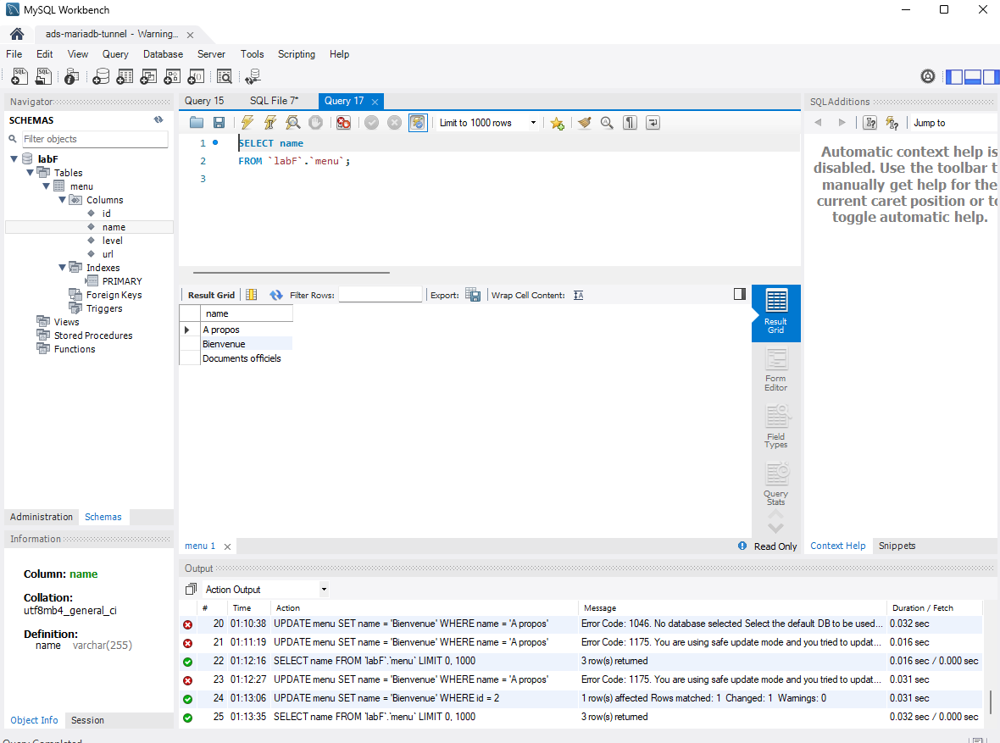

# **Rapport : Laboratoire – Génération d’une page web avec shell**

## **Auteurs**

- Harun Ouweis
- Mouti Amir

---

## **1. Introduction**

Ce rapport documente les étapes réalisées dans le cadre du laboratoire dont l’objectif est de générer automatiquement une page HTML listant des images et brochures de la HEIG-VD. Le processus est réalisé à l’aide de scripts bash exploitant les outils ImageMagick, SSH, Apache et la substitution de commandes sous Linux.

Chaque tâche est décrite avec l'entièreté de ce qui a été fait, afin de nous permettre une facilité de compréhension à notre propre relecture, mais contient tout de même les livrables attendus dans le cadre de ce laboratoire. Avec noté "livrable" les éléments qui ont été demandés.

---

## **2. Étape 0 – Préparation de l’environnement local (optionnelle)**

### **2.1. Installation d’ImageMagick**

#### **Commande exécutée**

```bash
sudo apt install imagemagick
```

#### **Sortie obtenue**

Installation réussie, ImageMagick est accessible via les commandes `convert` et `identify`.

#### **Explication**

ImageMagick est une suite d'outils en ligne de commande permettant de manipuler des fichiers image (conversion, redimensionnement, métadonnées, etc.). Il est utilisé dans ce projet pour extraire des dimensions et générer des vignettes (thumbnails).

---

### **2.2. Installation du serveur Apache**

#### **Commande exécutée**

```bash
sudo apt install apache2
```

#### **Sortie obtenue**

Apache2 installé avec succès. Le service est ensuite démarré avec :

```bash
sudo service apache2 start
```

Et la page d'accueil est accessible sur : `http://localhost`.

#### **Explication**

Apache est un serveur HTTP permettant de servir des fichiers HTML localement, facilitant les tests sans déploiement sur le serveur distant. Il écoute sur le port 80 par défaut.

---

### **2.3. Activation du module `userdir`**

#### **Commandes exécutées**

```bash
sudo a2enmod userdir
sudo systemctl restart apache2
```

#### **Explication**

Le module `userdir` permet d’héberger un site web personnel dans le répertoire `~/public_html`, accessible via une URL de type `http://localhost/~nom_utilisateur/`.

Cela permet à chaque utilisateur Linux d’avoir son propre site web personnel local.

---

### **2.4. Création du dossier `public_html` et test**

#### **Commandes exécutées**

```bash
mkdir -p ~/public_html
echo "Test local Apache + userdir depuis WSL" > ~/public_html/foo.txt
```

#### **Test d’accès**

Accès via navigateur Windows à l’URL :

```
http://localhost/~tobioo/foo.txt
```

#### **Résultat initial**

```text
You don't have permission to access this resource.
```

#### **Explication et correction**

Apache bloquait l’accès car les **permissions par défaut** des dossiers ne permettaient pas à Apache d’entrer dans le dossier `public_html`. On a corrigé cela en appliquant les bonnes permissions :

```bash
chmod 755 ~
chmod 755 ~/public_html
chmod 644 ~/public_html/foo.txt
```

#### **Résultat final**

Après correction, le fichier `foo.txt` est bien accessible dans le navigateur via `http://localhost/~tobioo/foo.txt`.

---

### **2.5. Environnement utilisé**

Ce labo est réalisé sous WSL avec Ubuntu. Aucune redirection de port n’est nécessaire, contrairement à une machine virtuelle.

---

## **3. Étape 1 – Préparation du répertoire `public_html` sur le serveur**

### **3.1. Connexion au serveur distant via SSH**

#### **Commande exécutée depuis WSL :**

```bash
ssh labf0@ads.iict.ch
```

On entre le mot de passe associé à l’utilisateur `labf0`.

#### **Résultat obtenu :**

Connexion réussie au serveur distant `ads.iict.ch`. Un shell distant est disponible.

---

### **3.2. Création du répertoire `public_html`**

#### **Commande exécutée :**

```bash
mkdir -p ~/public_html
```

#### **Vérification :**

```bash
ls -ld ~/public_html
```

#### **Sortie obtenue :**

```bash
drwxrwxr-x 2 labf0 labf0 4096 Apr  1 12:52 /home/labf0/public_html
```

#### **Explication :**

Le répertoire `public_html` est requis pour héberger des fichiers accessibles via l’URL `https://ads.iict.ch/~labf0/`. Les permissions `775` permettent à Apache de lire les fichiers et d’entrer dans le dossier.

---

### **3.3. Création du fichier `foo.txt` pour test**

#### **Commande exécutée :**

```bash
echo "Page de test sur le serveur distant" > ~/public_html/foo.txt
```

#### **Vérification locale via le navigateur :**

```text
https://ads.iict.ch/~labf0/foo.txt
```

#### **Résultat obtenu :**

La page affiche bien le contenu :

```
Page de test sur le serveur distant
```

---

### **3.4. Conclusion**

La configuration minimale pour tester des fichiers sur le serveur distant est fonctionnelle. Le répertoire `public_html` est accessible via HTTPS et peut être utilisé pour héberger les éléments HTML générés dans les prochaines étapes du projet.

---

## **4. Étape 2 – Téléchargement et exploration des fichiers**

### **4.1. Téléchargement de l’archive ZIP**

#### **Commande exécutée sur le serveur distant (`ads.iict.ch`) :**

```bash
cd ~/public_html
curl -O https://ads.iict.ch/lab04_raw_files.zip
```

#### **Sortie obtenue :**

```
100 28.2M  100 28.2M    0     0   176M      0 --:--:-- --:--:-- --:--:--  176M
```

#### **Explication :**

La commande `curl -O` télécharge l’archive contenant les fichiers images et PDF nécessaires au projet. L’option `-O` permet de conserver le nom d’origine du fichier lors du téléchargement.

---

### **4.2. Décompression de l’archive**

#### **Commande exécutée :**

```bash
unzip lab04_raw_files.zip -d lab04_raw_files
```

#### **Sortie obtenue (extrait) :**

```
inflating: lab04_raw_files/lab04_raw_files/cheseaux.png
inflating: lab04_raw_files/lab04_raw_files/cours.jpg
...
inflating: lab04_raw_files/lab04_raw_files/yparc.png
```

#### **Explication :**

L’option `-d lab04_raw_files` permet de décompresser tout le contenu dans un sous-dossier nommé `lab04_raw_files`. Ce choix permet de bien organiser les fichiers sans encombrer le dossier `public_html` directement.

---

### **4.3. Vérification des fichiers extraits**

#### **Commande exécutée :**

```bash
ls -l lab04_raw_files/lab04_raw_files
```

#### **Fichiers présents :**

- 6 fichiers JPEG/JPG : `cours.jpg`, `dcim439.jpg`, `mur.jpg`, `showroom_fabrik.jpg`, ...
- 4 fichiers PNG : `cheseaux.png`, `img-430.png`, `st-roch.png`, `yparc.png`
- 5 fichiers PDF : `rapport-activite-2018.pdf`, ..., `rapport-annuel-2019.pdf`

---

### **4.4. Vérification des types de fichiers avec `file`**

#### **Commande exécutée :**

```bash
file lab04_raw_files/lab04_raw_files/*
```

#### **Extrait de sortie :**

```
cours.jpg: JPEG image data, 2500x1667
mur.jpg: JPEG image data, 2501x1667
rapport-activite-2018.pdf: PDF document, version 1.6
yparc.png: PNG image data, 1200 x 800
```

#### **Explication :**

La commande `file` permet d'inspecter le contenu des fichiers et de s'assurer qu’ils sont bien du type attendu. Cela confirme la présence correcte de fichiers JPEG/PNG/PDF.

---

### **4.5. Inspection des dimensions des images avec `identify`**

#### **Commande exécutée :**

```bash
identify lab04_raw_files/lab04_raw_files/*.jpg
```

#### **Sortie obtenue (extrait) :**

```
cours.jpg JPEG 2500x1667 ...
mur.jpg JPEG 2501x1667 ...
showroom_fabrik.jpg JPEG 3456x4608 ...
```

#### **Explication :**

La commande `identify` est fournie par ImageMagick et permet d’obtenir les dimensions exactes des images. Celles-ci seront utiles dans les étapes suivantes pour :

- renommer les fichiers avec leurs dimensions
- générer des miniatures à la bonne échelle

---

### **Conclusion**

L’archive contenant les images et brochures a été correctement téléchargée, décompressée et analysée. Les formats et dimensions sont conformes. Les fichiers sont désormais prêts à être utilisés dans les prochaines étapes de traitement par scripts.

---

## **5. Étape 3 – Traitement des images et PDF**

### **5.1. Script `show_dimensions` liverable 1**

#### **But**

Afficher pour chaque image JPEG ou PNG présente dans le dossier `lab04_raw_files/lab04_raw_files` :

- son **nom**
- ses **dimensions (largeur × hauteur)**

---

#### **Contenu du script `show_dimensions`**

```bash
#!/bin/bash

# Dossier contenant les images
IMAGE_DIR="lab04_raw_files/lab04_raw_files"

# Boucle sur tous les fichiers JPG et PNG
for img in "$IMAGE_DIR"/*.{jpg,jpeg,png,JPG,JPEG,PNG}; do
  # Vérifie que le fichier existe (évite les erreurs si aucun fichier trouvé)
  [ -e "$img" ] || continue

  # Récupère les dimensions avec identify
  dimensions=$(identify -format "%w x %h" "$img" 2>/dev/null)

  # Affiche le nom du fichier et ses dimensions
  echo "$(basename "$img") : $dimensions"
done
```

---

#### **Commandes exécutées pour créer et tester le script**

```bash
nano show_dimensions
chmod +x show_dimensions
./show_dimensions
```

---

#### **Sortie obtenue (extrait)**

```
cours.jpg : 2500 x 1667
dcim439.jpg : 1200 x 867
mur.jpg : 2501 x 1667
showroom_fabrik.jpg : 3456 x 4608
cheseaux.png : 2500 x 1667
img-430.png : 1920 x 858
st-roch.png : 1200 x 800
yparc.png : 1200 x 800
```

---

#### **Explication**

Le script exploite la commande `identify` fournie par **ImageMagick** pour obtenir les dimensions de chaque image. La boucle `for` permet de parcourir tous les fichiers d’extension `.jpg`, `.jpeg`, ou `.png`, indépendamment de la casse.

Il est important de vérifier avec `[ -e "$img" ]` que le fichier existe, car si aucun fichier ne correspond à l’extension, le motif `*.jpg` est interprété tel quel et pourrait causer une erreur.

Le nom du fichier est affiché sans son chemin complet grâce à `basename`.

---

### **5.2. Script `rename_pictures` livrable 2**

#### **But**

Créer une **copie renommée** de chaque image JPEG ou PNG du dossier `lab04_raw_files/lab04_raw_files`, en ajoutant les dimensions de l’image dans le nom du fichier.  
Les fichiers originaux ne doivent pas être modifiés, et le script doit éviter les doublons de renommage.

---

#### **Contenu du script `rename_pictures`**

```bash
#!/bin/bash

# Dossier contenant les images originales
SRC_DIR="lab04_raw_files/lab04_raw_files"

# Dossier de sortie (on le crée s'il n'existe pas)
DST_DIR="$SRC_DIR/renamed"
mkdir -p "$DST_DIR"

# Boucle sur toutes les images JPG et PNG
for img in "$SRC_DIR"/*.{jpg,jpeg,png,JPG,JPEG,PNG}; do
  # Vérifie l'existence du fichier
  [ -e "$img" ] || continue

  # Nom de base sans le chemin
  base=$(basename "$img")

  # Nom sans extension
  name="${base%.*}"

  # Extension en minuscule
  ext="${base##*.}"
  ext="${ext,,}"

  # Récupère les dimensions
  dimensions=$(identify -format "%w_%h" "$img" 2>/dev/null)

  # Construit le nom de fichier destination
  newname="${name}_${dimensions}.${ext}"

  # Évite les doublons ou réapplications
  if [[ "$base" != *"_${dimensions}"* ]]; then
    cp "$img" "$DST_DIR/$newname"
    echo "Copié : $base → $newname"
  else
    echo "Ignoré (déjà renommé) : $base"
  fi
done
```

---

#### **Commandes exécutées**

```bash
nano rename_pictures
chmod +x rename_pictures
./rename_pictures
```

---

#### **Sortie obtenue (extrait)**

```
Copié : cours.jpg → cours_2500_1667.jpg
Copié : dcim439.jpg → dcim439_1200_867.jpg
...
Copié : yparc.png → yparc_1200_800.png
```

#### **Contenu du dossier `renamed`**

```bash
cheseaux_2500_1667.png
cours_2500_1667.jpg
dcim439_1200_867.jpg
img-430_1920_858.png
mur_2501_1667.jpg
showroom_fabrik_3456_4608.jpg
st-roch_1200_800.png
yparc_1200_800.png
```

---

#### **Explication**

Le script parcourt toutes les images du dossier source et :

- extrait leur nom, extension et dimensions
- construit un nouveau nom du type : `nom_largeur_hauteur.extension`
- copie chaque fichier renommé dans un sous-dossier `renamed/` (créé automatiquement)
- évite les renommages multiples grâce à une vérification simple du nom

Ce fonctionnement évite l'accumulation de suffixes comme `image_1024_768_1024_768.jpg`.

---

### **5.3. Script `make_thumbnails` livrable 3**

#### **Objectif**

Générer une **vignette** (thumbnail) pour :

- chaque image JPEG ou PNG du répertoire `lab04_raw_files/lab04_raw_files`
- chaque fichier PDF (1ère page uniquement)

Les vignettes sont créées avec une largeur ou hauteur maximale de **300 pixels** et sont enregistrées dans un dossier `thumbs/` à part.

---

#### **Contenu du script `make_thumbnails`**

```bash
#!/bin/bash

# Dossier source contenant les fichiers
SRC_DIR="lab04_raw_files/lab04_raw_files"

# Dossier de sortie des thumbnails
THUMB_DIR="$SRC_DIR/thumbs"
mkdir -p "$THUMB_DIR"

# Traitement des images (JPG, JPEG, PNG)
for img in "$SRC_DIR"/*.{jpg,jpeg,png,JPG,JPEG,PNG}; do
  [ -e "$img" ] || continue

  filename=$(basename "$img")
  name="${filename%.*}"
  ext="${filename##*.}"
  ext="${ext,,}"

  # Nom du thumbnail
  thumb="${THUMB_DIR}/${name}_thumb.${ext}"

  # Éviter de refaire des thumbnails existants
  if [[ "$filename" != *_thumb.* ]]; then
    convert "$img" -geometry 300 "$thumb"
    echo "Thumbnail créé : $thumb"
  else
    echo "Ignoré (déjà un thumbnail) : $filename"
  fi
done

# Traitement des PDF (convertit la 1ère page en JPG)
for pdf in "$SRC_DIR"/*.pdf; do
  [ -e "$pdf" ] || continue

  filename=$(basename "$pdf")
  name="${filename%.*}"
  thumb="${THUMB_DIR}/${name}.jpg"

  # Éviter de refaire le thumbnail
  if [ ! -f "$thumb" ]; then
    convert -geometry 300 "${pdf}[0]" "$thumb"
    echo "Thumbnail PDF créé : $thumb"
  else
    echo "Ignoré (déjà existant) : $thumb"
  fi
done
```

---

#### **Commandes exécutées**

```bash
nano make_thumbnails
chmod +x make_thumbnails
./make_thumbnails
```

---

#### **Sortie obtenue (extrait)**

```
Thumbnail créé : .../cours_thumb.jpg
Thumbnail créé : .../showroom_fabrik_thumb.jpg
Thumbnail PDF créé : .../rapport-activite-2019.jpg
...
```

---

#### **Contenu du dossier `thumbs`**

```bash
cheseaux_thumb.png
cours_thumb.jpg
dcim439_thumb.jpg
img-430_thumb.png
mur_thumb.jpg
rapport-activite-2018.jpg
rapport-activite-2019.jpg
rapport-activite-2020.jpg
rapport-annuel-2018.jpg
rapport-annuel-2019.jpg
showroom_fabrik_thumb.jpg
st-roch_thumb.png
yparc_thumb.png
```

---

#### **Explication**

Le script utilise la commande `convert` de **ImageMagick** pour créer :

- des vignettes nommées `*_thumb.ext` pour les images
- des vignettes `nom.pdf → nom.jpg` pour les PDF

Les conditions `[[ "$filename" != *_thumb.* ]]` et `[ ! -f "$thumb" ]` permettent d’**éviter les doublons** ou la transformation de fichiers déjà traités.  
L’utilisation d’un dossier `thumbs` centralise les fichiers générés pour simplifier l’organisation.

---

## **6. Étape 4 – Génération de la page HTML**

---

### **6.1. Template HTML**

#### **Objectif**

Utiliser un **modèle HTML fourni** par le webmaster pour structurer une page statique affichant :

- Une galerie d’images sous forme de vignettes cliquables
- Une section de brochures PDF illustrées par une image de couverture

#### **Découpage**

Le modèle `index.html` a été **divisé manuellement** en deux parties :

- `template_begin.html` :  
  Contient le doctype, l’en-tête HTML, l’ouverture des balises et le titre “Découvrez-nous en images”
  
- `template_end.html` :  
  Contient uniquement la **fermeture des balises HTML**, **sans contenu statique** de la section brochures  
  (ce bloc est désormais généré dynamiquement par le script)

---

#### **Fichier `template_begin.html`**

```html
<!DOCTYPE html>
<html lang="fr">
<head>
  <meta charset="UTF-8">
  <title>HEIG-VD – Galerie</title>
  <link rel="stylesheet" href="https://ads.iict.ch/style.css">
</head>
<body>
  <article class="container article">
    <div class="row">
      <div class="col-md-10 col-md-pull-3 col-md-offset-4 article__content">
        <div>
          <div><h2>Découvrez-nous en images</h2></div>
        </div>
        <div class="row">
```

---

#### **Fichier `template_end.html`**

```html
          <!-- Les brochures seront ajoutées ici dynamiquement par le script -->
        </div>
      </div>
    </div>
  </article>
</body>
</html>
```

---

### **6.2. Script `make_html` livrable 4**

#### **Objectif**

Générer automatiquement un fichier `page.html` structuré avec :

- Les images renommées (avec dimensions) affichées via leurs vignettes
- Les fichiers PDF affichés avec une miniature de leur première page
- Le tout inséré entre un début et une fin de page HTML statique

---

#### **Contenu du script `make_html`**

```bash
#!/bin/bash

# Répertoire de travail
BASE_DIR="lab04_raw_files/lab04_raw_files"
RENAMED_DIR="$BASE_DIR/renamed"
THUMBS_DIR="$BASE_DIR/thumbs"
OUTPUT="page.html"

# Nettoyage du fichier de sortie
rm -f "$OUTPUT"

# Inclusion du début du template
cat template_begin.html >> "$OUTPUT"

# Génération des images (section "Découvrez-nous en images")
for img in "$RENAMED_DIR"/*.{jpg,jpeg,png}; do
  [ -e "$img" ] || continue
  base=$(basename "$img")
  name="${base%.*}"
  ext="${base##*.}"
  ext="${ext,,}"

  # On enlève les dimensions du nom (dernier "_<nombre>_<nombre>")
  thumb_name=$(echo "$name" | sed -E 's/_[0-9]+_[0-9]+$//')_thumb.${ext}

  echo "    <div class=\"col-md-6 col-xs-12\">" >> "$OUTPUT"
  echo "      <a href=\"$RENAMED_DIR/$base\"></a>" >> "$OUTPUT"
  echo "    </div>" >> "$OUTPUT"
done

# Fermeture de la section images + ouverture de la section brochures
cat <<EOF >> "$OUTPUT"
        </div>
      </div>
    </div>
    <div class="row" style="margin-top: 40px;">
      <div class="col-md-10 col-md-pull-3 col-md-offset-4 article__content">
        <div>
          <div><h2>Téléchargez nos brochures</h2></div>
        </div>
        <div class="row">
EOF

# Génération des PDF
for pdf in "$BASE_DIR"/*.pdf; do
  [ -e "$pdf" ] || continue
  base=$(basename "$pdf")
  name="${base%.*}"

  thumb="$THUMBS_DIR/$name.jpg"
  echo "    <div class=\"col-md-6 col-xs-12\">" >> "$OUTPUT"
  echo "      <a href=\"$BASE_DIR/$base\"></a>" >> "$OUTPUT"
  echo "    </div>" >> "$OUTPUT"
done

# Inclusion de la fin du template
cat template_end.html >> "$OUTPUT"

echo "Fichier $OUTPUT généré avec succès."
```

---

#### **Commandes exécutées**

```bash
chmod +x make_html
./make_html
```

---

#### **Sortie obtenue**

```bash
Fichier page.html généré avec succès.
```

---

#### **Vérification**

Le fichier final `page.html` contient bien :

- Un en-tête HTML correct
- Une galerie d’images avec vignettes cliquables
- Une section brochures avec miniatures de couverture

La page est accessible à l’URL :

```
https://ads.iict.ch/~labf0/page.html
```

---

## **7. Étape 5 – Connexion distante à la base de données (SSH Tunnel)**

---

### **7.1. Commande SSH livrable 5**

Afin d'accéder à la base de données MariaDB qui n'est pas accessible directement depuis l'extérieur, nous avons mis en place un **tunnel SSH** redirigeant un port local vers le port 3306 du serveur distant `ads.iict.ch`.

La commande exécutée dans le terminal WSL est la suivante :

```bash
ssh -L 3336:localhost:3306 labf0@ads.iict.ch
```

- `-L 3336:localhost:3306` : redirige le port local `3336` vers `localhost:3306` **depuis la perspective du serveur distant**
- La connexion reste active tant que le tunnel est nécessaire

Une fois cette commande exécutée, nous avons laissé la session SSH ouverte pendant toute la session de travail avec **MySQL Workbench**.

---

### **7.2. Configuration dans MySQL Workbench**

Nous avons installé **MySQL Workbench sur Windows** puis créé une connexion avec les paramètres suivants : Après test, la connexion a été **établie avec succès**.

---

### **7.3. Visualisation de la base de données**

Nous avons exploré la base `labF` et consulté la table `menu`.

Cette table contient les éléments de navigation affichés sur la page dynamique `task5.php`.

---

### **7.4. Modification effectuée**

Nous avons modifié le contenu de la table en exécutant la requête suivante :

```sql
UPDATE menu SET name = 'Bienvenue' WHERE id = 2;
```

Cette commande a mis à jour l'entrée `id = 2`, dont le champ `name` contenait initialement `"HEIG-VD"`, en `"Bienvenue"`.

Après avoir rechargé la page :

```
https://ads.iict.ch/~labf0/template/lab04_template/task5.php
```

La modification était bien visible dans le menu de navigation.

---

### **7.5. Capture d’écran MySQL Workbench livrable 6**



---
